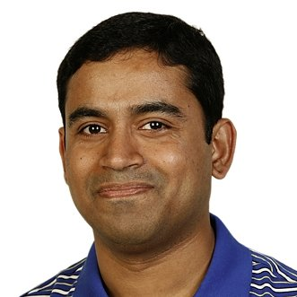
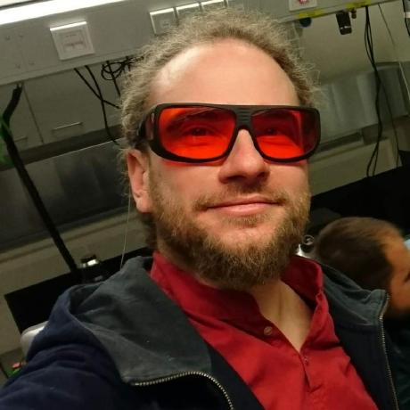
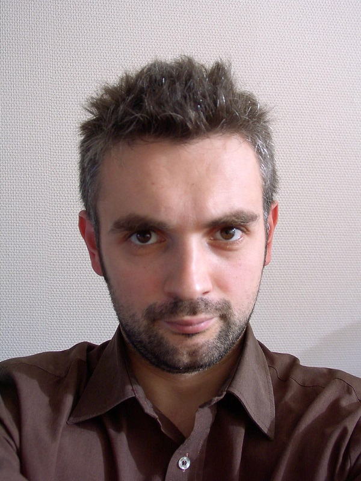

# NEUBIAS Bioimage Analyst School 2019

Dates: Feb 2nd - 5th, 2019
Place: Luxembourg

Organizers: Kota Miura, Chong Zhang & Jean-Yves Tinevez

## Aim

This school aims at providing bioimage analysts with practical access to the latest bioimage analysis workflows and their components. Many software/library packages are updated and new ones are appearing on daily basis, but analysts tend to be constrained to what one knows already and omit the use of new components. They are too busy. We hope that this school will become a good chance for analysts to be exposed to some of the latest scene in the bioimage analysis, of various workflows and workflow components, to widen their scope and broaden their skills. The school also aims for the community buidling amond bioimage analysis experts - it's always good to have friends with similar interests!

The school program this year combines the best of two previous schools in Lisbon and in Szeged, based on feedback from participants. From this year, the school is followed by a half-day "**BioImage Analyst Satellite Meeting**", where bioimage analysts, accepting more participants than the school, to exchange practical information in a non-formal interactive sessions. 

## Place and Time

### Place

University’s Belval Campus in Esch-sur-Alzette, Luxembourg 

### Time

Feb 2 (Sat), 11:00  - 5 (Tue) 13:00, 2019

## The program 

|                      | Day 1 (Feb. 2)       | Day 2 (Feb. 3)                  | Day 3 (Feb. 4)              | Day 4 (Feb. 5) |
| -------------------- | -------------------- | ------------------------------- | --------------------------- | -------------- |
| Morning 1            | David                | Ignacio (TBC)                   | Sian                        | (TBC)          |
| Morning 2            | Components (Pejmn).  | Deconstruction (Julius Hossain) | Deconstruction by students. | Presentations  |
| Afternoon & evening. | Components (Robert). | Deconstruction (Julius Hossain) | Deconstruction by students  |                |

The school is based on the concepts of "workflows and components" in bioimage analysis ([more details here](https://www.authorea.com/users/90123/articles/211121-workflows-and-components-of-bioimage-analysis-the-neubias-concept)) and will be with four types of modules: **Workflow Deconstruction**, **Advanced Usage of Workflow Components**, **Forums** and **Implementation**. 

In **Workflow Deconstruction**, we reproduce, trace and modify bioimage analysis workflows. Invited author of the selected workflow present the bioimage analysis workflow in details: the biological problem, algorithms of components including statistical analysis, how they are assembled into the workflow to output either numbers, plots or visualization results. In parallel with these explanations, participants will load those components and reproduce the workflow on their own laptop (reproduce the workflow). Interactive discussion on following points will be moderated.

- Used components and algorithms
- The overall design of the workflow
- Reuse of certain component blocks for different biological problems
- Capability of running the workflow in various environments 

This year, [Julius Hossain (EMBL, @JuliusHossain)](https://www.embl.de/research/units/cbb/ellenberg/members/index.php?s_personId=CP-60014993) will guide us through the framework that underlies the latest work of his group:

- **Experimental and computational framework for a dynamic protein atlas of human cell division**
  - Yin Cai, M. Julius Hossain, Jean-Karim Hériché, Antonio Z. Politi, Nike Walther, Birgit Koch, Malte Wachsmuth, Bianca Nijmeijer, Moritz Kueblbeck, Marina Martinic-Kavur, Rene Ladurner, Stephanie Alexander, Jan-Michael Peters & Jan Ellenberg
  - https://www.nature.com/articles/s41586-018-0518-z

We will use the framework of this paper to serve as the basis for or deconstructon activities. Expect to go from start to finish, including post-data analysis considerations.

In **Advanced Usage of Workflow Components**, invited experts present in-depth explanation about workflow components, and train the essential and effcient access to the API (We call this **API-beating**). This training is aiming to encourage participants to expand their skill and technique to utilize cutting-edge components in their workflow they construct in future. 

This year we will learn about:
- Deep-Learning techniques for segmentation of Lice-Sciences images.
- Super-resolution image reconstruction and analysis.
- ImageJ2 and ImgLib2 scripting an programming, and in the context of large images.

In **Forums**, we will discuss various aspects related to bioimage analysis - with interests surrounding analysts as a profession  (_e.g._ How do we teach bioimage analysis? Employment conditions?). Discussion results are summarized and will be reported to the NEUBIAS community.

In **Implementation**, participants are split into several groups, and each group implements one of the following issues:

1. Modification of workflows presented in the school, for either 
   1. the full workflow running in different ecosystems
   2. a part of the workflow replaced with a different component. 
2. Comparison and benchmarking of workflow components with similar algorithms. The target components should be selected by each group.

## Participation Requirements

Participants are expected to be bioimage analysts, analyzing biological image data on daily basis. 

Please bring your own laptop! We do not provide machines.  

We expect some fluency in at least one programming language. We do not teach coding, but intensively do coding using several different languages. Skills / flexibility to follow such sessions are a prerequisite. Specific workflow organizers will however provide some 'homework' to prepare for their module, containing leads to learn a language and prepare for the installation of the required softwares on your laptop.

**There will be no helpers during all sessions. ** We rather promote attending bioimage analysts to to help each other, also for the networking.

During registration, the applicant is asked to submit at least one bioimage analysis workflow that one has authored / worked on (starting with a specific biological question, describe the workflow in a short paragraph and the type of results: numbers, plots and/or visualization - does not have to be a published paper). Among these applicants, some are selected for presentation as "Workflow Deconstruction" session and lead the session. 

## Workflow Deconstruction: Details

- Invited Author: - Julius Hossein, EMBL Heidelberg
   - 
- Details of [Preparation and Homeworks](Julius_Construction_additional_details.md)
- Concepts

   - Tracing the workflow, starting with sample image data, understand the biological problem, do image processing and data analysis, ends up in numbers, plots or visualizations. 
   - Explanation for each step (or each component) are given and interesting algorithms are picked up and discussed in details. 
   - Each participant uses ones own laptop to reproduce / modify the workflow
   - Interactions: questions on components, a proposal for alternative solutions, discussion on capability in other ecosystems. 
   - Invited "workflow authors" + Selected "workflow authors" from applicants (registration form should include an abstract of submission of interesting workflow)

## Advanced Workflow Components: Details

###  API-beating: ImgLib2, ImageJ2 and Big-Data Viewer

- Invited Author: Robert Haase (CSBD Dresden, https://myerslab.mpi-cbg.de/robert-haase/, @haesleinhuepf)
   - 
- [preparation and homeworks](Robert_IJAPIbeating.md)

### Deep-Learning to segment Life-Science images.

- Invited Authors
  - Pejamn Rasti (Angers University,http://perso-laris.univ-angers.fr/~rasti/, @pejmanrasti)
     - 
  - David Rousseau (Angers University)  
    -  

### Super-resolution images reconstruction and analysis.

- Invited Author: Sian Culley (University College London, http://www.ucl.ac.uk/lmcb/users/sian-culley, @SuperResoluSian)
   - 

## Workflows, Student Presentations

Some workflows submitted by participants during registration will be selected for presentation during the school. 

## Implementations / Presentations

School participants are asked to present their implementations (by group) on the last day of the school. 7 groups, 15 minutes presentation + 5 minutes questions and answers. 

 

## Time Table

Below is the tentative schedule. Some slots are still unconfirmed. 

<iframe src="https://docs.google.com/spreadsheets/d/e/2PACX-1vQXTjpLEt060RJNGfWT4eAp6Sji_iRpIXGWfOxUItUBvFTdaJpV6eZwdR5JxQ0XER_4evki8gMfJlJe/pubhtml?gid=0&amp;single=true&amp;widget=true&amp;headers=false" height="1200"></iframe>

It's going to be great!
